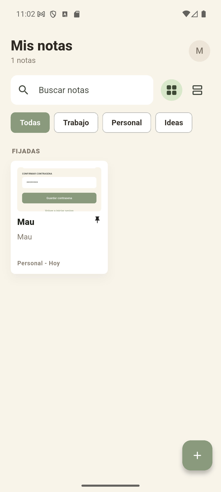
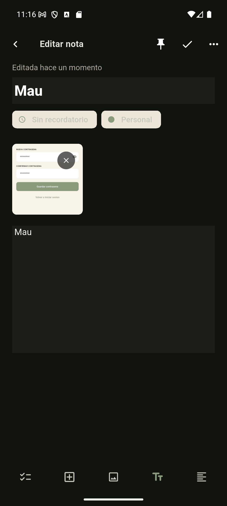
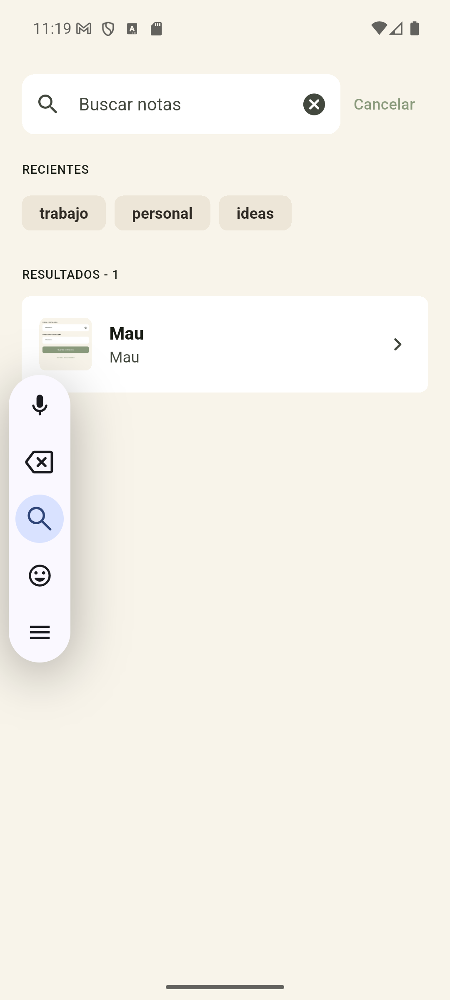
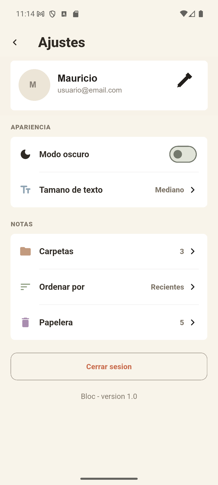
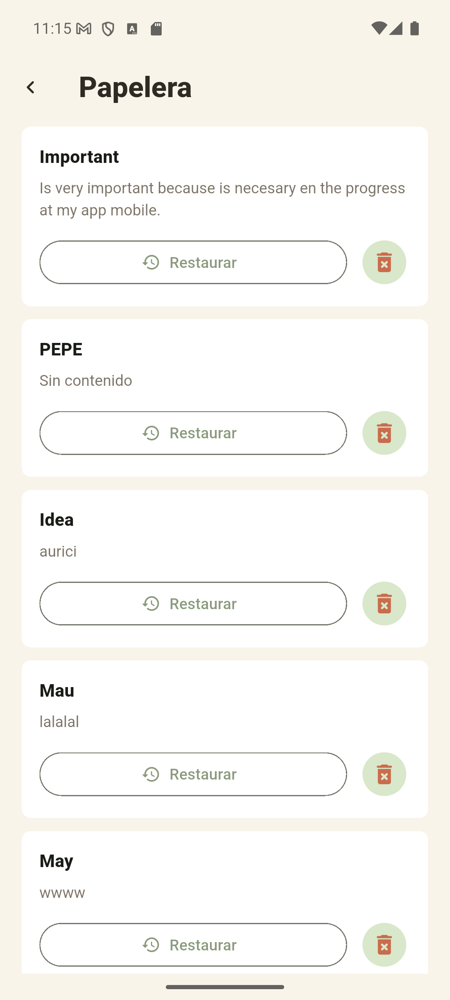
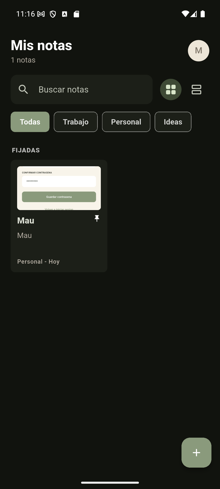
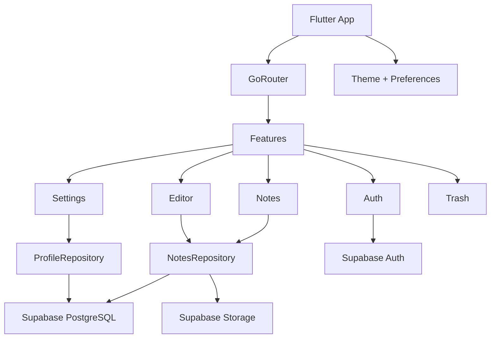

# Bloc Notes

Aplicacion movil de notas construida con Flutter y Supabase. Bloc busca una
experiencia tranquila y clara para capturar ideas, escribir notas, crear listas,
organizar contenido por carpetas y guardar imagenes.

El proyecto parte de los mockups incluidos en `Bloc.pdf` y del flujo mostrado en
`Bloc Demo.mp4`.

## Estado

Fases completadas funcionalmente:

- Fase 1: Preparacion del entorno y proyecto Flutter.
- Fase 2: Front-end base.
- Fase 3: Base de datos en Supabase.
- Fase 4: Auth, sesion y sincronizacion CRUD.
- Fase 5: Pulido UX.
- Fase 5.1: Imagenes en notas con Supabase Storage.

Fase actual:

- Fase 7: Testing y build Android.

## Caracteristicas

- Onboarding inicial.
- Registro e inicio de sesion con correo/password.
- Inicio de sesion con Google via Supabase OAuth.
- Recuperacion de contrasena con deep link `blocnotes://reset-password`.
- Sesion persistente con Supabase Auth.
- Home de notas en vista grid/lista.
- Busqueda por titulo, contenido y carpeta.
- Filtros por carpeta.
- Crear y editar notas de texto.
- Crear y editar notas tipo checklist.
- Fijar/desfijar notas.
- Agregar imagenes desde galeria.
- Subida de imagenes a Supabase Storage.
- Miniaturas de imagen en Home y Busqueda.
- Borrado logico con papelera.
- Restauracion y eliminacion definitiva desde papelera.
- Perfil con nombre/correo.
- Modo oscuro.
- Tamano de texto configurable.
- Ordenamiento por recientes, titulo o carpeta.
- Estados vacios, loading, errores y validaciones.

## Screenshots

Capturas reales tomadas desde el emulador Android durante la Fase 6.

| Home | Editor | Busqueda |
| --- | --- | --- |
|  |  |  |

| Ajustes | Papelera | Modo oscuro |
| --- | --- | --- |
|  |  |  |

## Stack

- Flutter + Dart
- Riverpod para estado
- GoRouter para navegacion
- Supabase Auth
- Supabase PostgreSQL
- Supabase Storage
- `image_picker` para galeria
- Android Studio / Android SDK para emulador y builds
- VS Code como editor principal

## Arquitectura



## Estructura

```text
lib/
  app/
    preferences/       Preferencias UI: texto, orden, vista
    router/            Rutas y guards de autenticacion
    theme/             Colores, tema claro/oscuro
  core/
    config/            Lectura de dart-define
    models/            Modelos base
    services/          Bootstrap Supabase
  features/
    auth/              Login, registro, password reset
    editor/            Crear/editar notas, checklist, imagenes
    home/              Home, filtros, grid/lista
    notes/             Repositorio de datos
    onboarding/        Pantalla inicial
    search/            Busqueda
    settings/          Perfil, preferencias, logout
    trash/             Papelera
  shared/
    widgets/           Componentes reutilizables
supabase/
  migrations/          SQL versionado
  repair_*.sql         Scripts idempotentes de reparacion
  verify_*.sql         Scripts de verificacion
docs/
  DATABASE.md          Modelo de datos y Storage
  SUPABASE_SETUP.md    Guia de Supabase
  ROADMAP.md           Fases y pendientes
```

## Requisitos

- Flutter 3.44.4 o compatible
- Dart SDK incluido con Flutter
- Android Studio / Android SDK
- Emulador Android o dispositivo fisico
- Proyecto Supabase

En esta maquina Flutter esta instalado en:

```text
C:\Users\mauri\development\flutter
```

## Configuracion

Clona el repositorio y entra al proyecto:

```powershell
git clone <repo-url>
cd appBloc
```

Instala dependencias:

```powershell
flutter pub get
```

Crea un proyecto Supabase y aplica los scripts:

1. Ejecuta `supabase/migrations/0001_initial_schema.sql`.
2. Ejecuta `supabase/setup_note_images.sql`.
3. Opcional: ejecuta `supabase/verify_schema.sql`.
4. Opcional: ejecuta `supabase/verify_user_bootstrap.sql` despues de crear un usuario.

Configura Auth en Supabase:

- Habilita Email provider.
- Habilita Google provider si usaras Login con Google.
- En Authentication > URL Configuration agrega:

```text
blocnotes://auth-callback
blocnotes://reset-password
```

Para Google Cloud, agrega como Authorized redirect URI:

```text
https://your-project-ref.supabase.co/auth/v1/callback
```

## Variables

La app usa `--dart-define`; no guardes llaves reales dentro del repositorio.

```powershell
flutter run -d emulator-5554 `
  --dart-define=SUPABASE_URL=https://your-project-ref.supabase.co `
  --dart-define=SUPABASE_PUBLISHABLE_KEY=your-publishable-key
```

Tambien existe `.env.example` solo como referencia de nombres:

```text
SUPABASE_URL=https://your-project-ref.supabase.co
SUPABASE_PUBLISHABLE_KEY=your-publishable-key
```

## Supabase

Tablas principales:

- `profiles`
- `folders`
- `notes`
- `note_items`

Storage:

- Bucket: `note-images`
- Ruta de archivo: `{user_id}/{note_id}/{timestamp}.{extension}`

Seguridad:

- RLS activo en tablas de usuario.
- Cada usuario solo accede a sus notas/carpetas/perfil.
- Storage permite subir/editar/eliminar solo dentro de la carpeta del usuario.
- El bucket de imagenes es publico para permitir renderizar miniaturas.

Mas detalles:

- `docs/DATABASE.md`
- `docs/SUPABASE_SETUP.md`
- `supabase/README.md`

## Comandos

Analisis:

```powershell
flutter analyze
```

Tests:

```powershell
flutter test
```

Ejecutar en emulador:

```powershell
flutter run -d emulator-5554 `
  --dart-define=SUPABASE_URL=https://your-project-ref.supabase.co `
  --dart-define=SUPABASE_PUBLISHABLE_KEY=your-publishable-key
```

Build APK:

```powershell
flutter build apk --release `
  --dart-define=SUPABASE_URL=https://your-project-ref.supabase.co `
  --dart-define=SUPABASE_PUBLISHABLE_KEY=your-publishable-key
```

Build AAB:

```powershell
flutter build appbundle --release `
  --dart-define=SUPABASE_URL=https://your-project-ref.supabase.co `
  --dart-define=SUPABASE_PUBLISHABLE_KEY=your-publishable-key
```

## Validacion Actual

Ultima validacion local:

- `flutter analyze`: sin issues.
- `flutter test`: pasando.
- Pruebas manuales en emulador `Pixel_7`.

Flujos validados manualmente:

- Registro/login.
- Recuperacion de contrasena.
- Crear/editar nota.
- Crear checklist.
- Fijar nota.
- Buscar y filtrar.
- Cambiar carpeta.
- Papelera/restauracion.
- Editar perfil.
- Modo oscuro.
- Agregar imagen y ver miniatura.
- Login con Google cuando el provider esta configurado en Supabase/Google Cloud.

## Roadmap

Siguiente fase:

- Fase 7: pruebas adicionales, build Android APK/AAB y revision final.

Despues:

- Fase 7: pruebas adicionales y build Android APK/AAB.

Pendientes funcionales futuros:

- Recordatorios reales con notificaciones.
- Gestion avanzada de carpetas desde la app.
- Login social con Apple.
- Limpieza de imagenes huerfanas al borrar definitivamente una nota.

## Licencia

Este proyecto esta publicado bajo licencia MIT. Consulta el archivo
[`LICENSE`](LICENSE) para ver los terminos completos.
