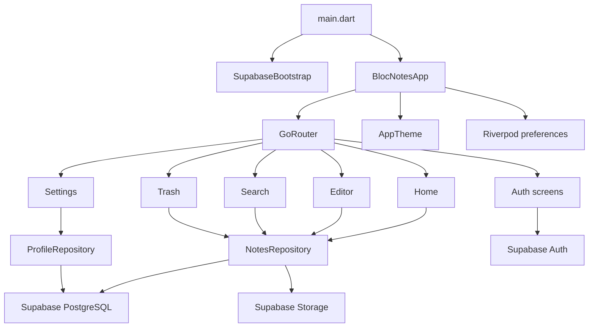

# Arquitectura

Bloc Notes esta organizado por capas simples y features. La intencion es que la
UI pueda evolucionar sin mezclar reglas de Supabase directamente dentro de cada
pantalla.

## Flujo general

## Responsabilidades

- `app/router`: rutas, redirects y proteccion por sesion.
- `app/theme`: paleta, tipografia y modo claro/oscuro.
- `app/preferences`: preferencias de UI con Riverpod.
- `core/config`: configuracion por `--dart-define`.
- `core/models`: modelos puros usados por UI y repositorios.
- `features/*/presentation`: pantallas y widgets especificos.
- `features/*/data`: repositorios y acceso a Supabase.
- `supabase/`: migraciones, verificacion y scripts de reparacion.

## Decisiones

- Supabase se inicializa solo si existen `SUPABASE_URL` y
  `SUPABASE_PUBLISHABLE_KEY`.
- En modo sin Supabase, la app usa datos mock para desarrollo visual.
- `image_urls` se sincroniza solo cuando hay cambios de imagen para mantener
  compatibilidad con proyectos que aun no aplican la migracion de Storage.
- La papelera usa borrado logico con `deleted_at`.
- Las imagenes viven en Storage y la tabla `notes` conserva solo URLs publicas.
